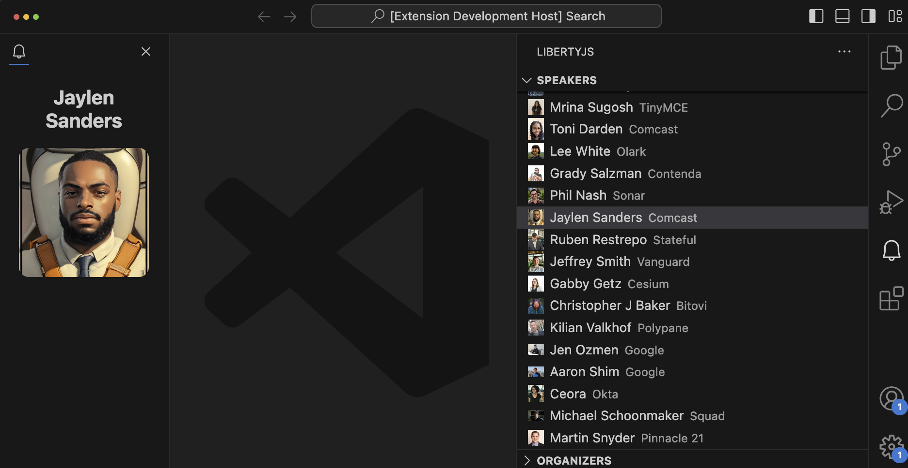

## LibertyJS VS Code Extension



This extension shows how to use:
- Use TreeProvider contributing an ActivityBar view container.
- Use WebviewViewProvider with custom components using [lit](https://lit.dev/)

We use [yo](https://www.npmjs.com/package/yo) to start a new extension from scracth. Skip this step since we've already initialized this repository with the tool.

```sh
npx yo .
```

# Start the extension locally

```sh
npm run watch
```

## Pack the extension

```sh
npx vsce package -t darwin-x64
```

The target depends on your OS and Architecture, to see other supported platforms run:

```sh
npx vsce package --help
```